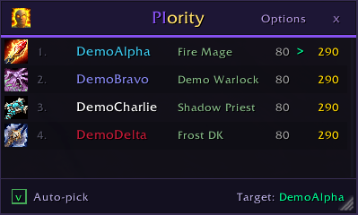
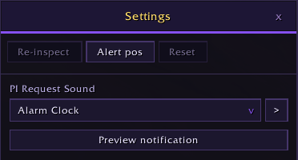
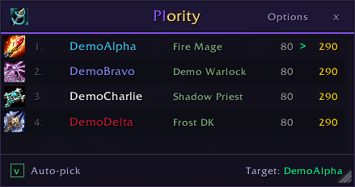
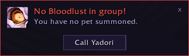
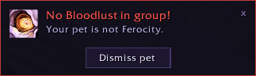

# PIority

PIority is a World of Warcraft addon for priests and hunters that takes the guesswork out of buff targeting. As a priest, it scans your party or raid, inspects every member's specialization and item level, and presents a ranked list sorted by which specs benefit most from Power Infusion — click any row to instantly update your PI_H macro to that player. As a hunter, it automatically points your MD_H Misdirection macro at the first tank in your group, or at your own pet when solo.

## Features

- **Priority-sorted roster** — all 32 DPS/tank specs ranked by PI value, with class-colored names and spec labels
- **Auto-pick mode** — priests automatically target the highest-priority player when everyone's spec is known; hunters automatically target the group's tank
- **Hunter Misdirection support** — maintains an MD_H macro targeting your tank in groups or your pet when solo
- **Bloodlust watch** — hunters in a 5-man group with no Shaman/Mage/Evoker get a warning when their summoned pet isn't Ferocity, with a one-button swap that dismisses the current pet and calls a Ferocity pet from their call slots
- **Smart defaults** — the macro resets to yourself (priest) or your pet (hunter) when you leave a group
- **Item level display** — shows each player's average equipped ilvl alongside their spec
- **Addon presence indicator** — highlights group members who also have PIority installed
- **PI request notifications** — if your current PI target sends a /pirequest, a dismissable alert pops up with a pulsing spell icon and a raid warning sound (spam-protected)
- **Per-character targets** — every character remembers its own macro target between sessions
- **Persistent layout** — window position, size, open state, and notification frame position are saved between sessions; main and settings windows share one position across all characters by default, with a settings checkbox to switch to per-character positions
- **Slash commands** — `/pi` (priests) or `/md` (hunters) to toggle the window — both work for both classes — plus `target <name>` to set directly and `/pirequest` for players to alert their priest

## Screenshots

## Slash commands

`/pi` and `/md` are interchangeable aliases — `/pi` is shown to priests, `/md` to hunters, but both work for every class.

| Command | Effect |
|---|---|
| `/pi` or `/md` | Toggle the roster window |
| `/pi target <name>` | Set the macro target directly |
| `/pi help` | Print command help |
| `/pirequest` | Alert your priest that you want Power Infusion (usable by any group member, e.g. from a macro) |

## Localization

English and German (deDE).
